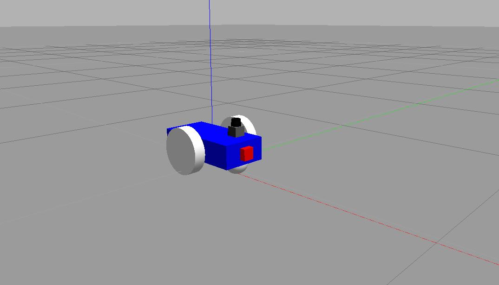
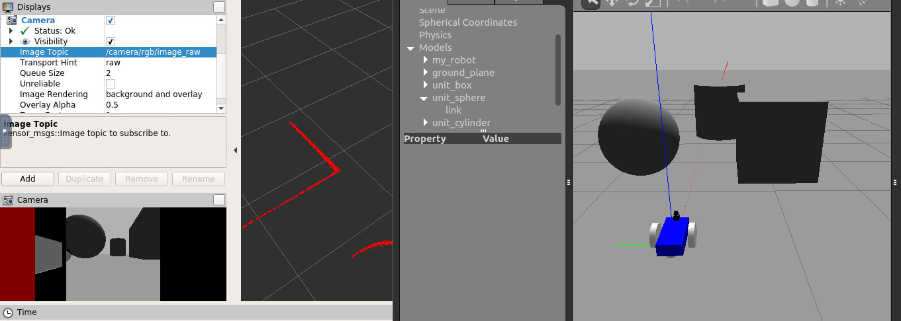
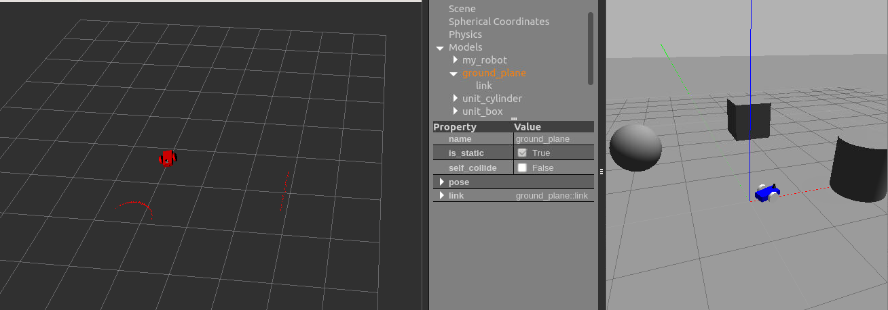

# my_robot

A differntial drive robot with camera and Hokuyo laser scanner


## Plugins
using plugins for 
```
Differtial Drive -> differential_drive_controlle : " libgazebo_ros_diff_drive.so "
Camera -> camera_controller :  " libgazebo_ros_camera.so "
Laser Scanner -> gazebo_ros_head_hokuyo_controller : " libgazebo_ros_laser.so "
```
from gazebo http://gazebosim.org/tutorials?tut=ros_gzplugins#Camera

## Rviz_view
### Camera

### Laser_scanner

